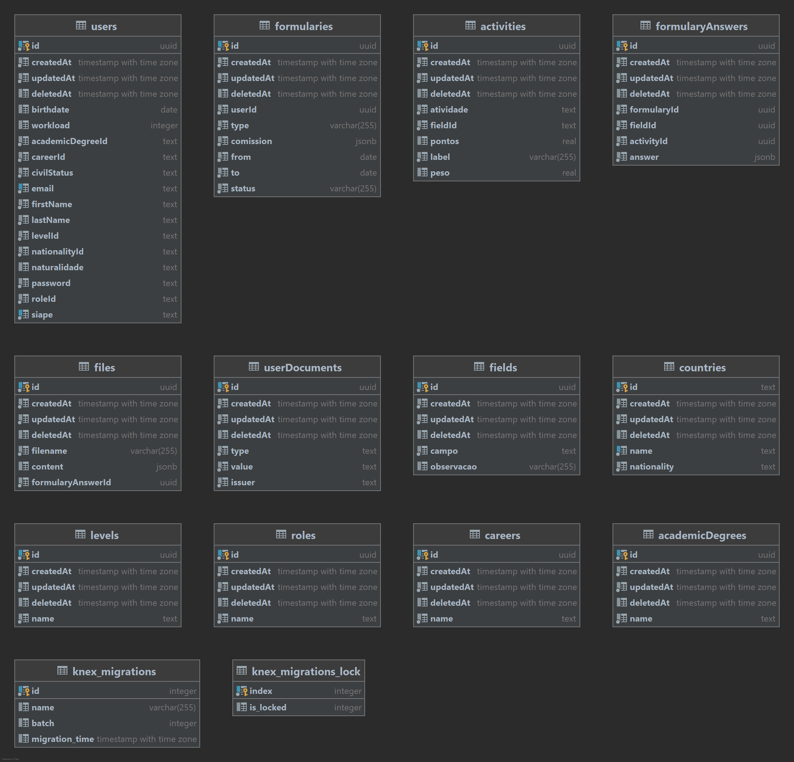
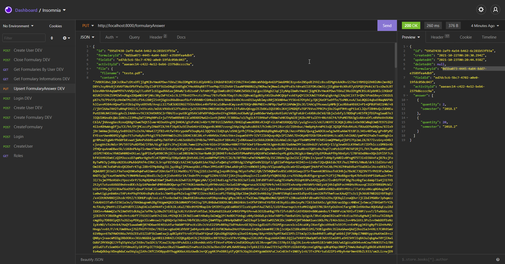

# Progressão Acadêmica

## Tecnologias

---

- NodeJs
- Typescript
- Postgres
- Knex
- Docker

## How To

---

Para executar o projeto é necessário que tenha instalado em sua máquina o Docker e o NodeJS.

- Crie um arquivo novo `.env` contendo:

```
ENVIRONMENT=local
DB_HOST=localhost
DB_USERNAME=postgres
DB_PASSWORD=postgres
DB_DATABASE=example
DB_PORT=5432
DB_LOGGING=true
PORT=8000
JWT_SECRET=boloDeMulango
SMTP_TRANSPORT_URL=
```

- Após clonar o projeto em sua máquina, é necessário primeiramente realizar a instalação das dependências:
 ```
 npm i // ou npm ci
 ```

- Realizaremos a subida do banco:
 ```
 npm run postgres:start
 npm run database:create
 ```

- Após isso já é possível rodarmos o projeto através do:

```
npm run dev
```

## Sobre

---
### Database Diagram



## Routes
---

| Route           	| Method 	| Action                                                            	|
|-----------------	|--------	|-------------------------------------------------------------------	|
| /academicDegree 	| GET    	| Obtain all Academic Degrees from database                         	|
| /career         	| GET    	| Obtain all Careers from database                                  	|
| /level          	| GET    	| Obtain all Levels from database                                   	|
| /nationality    	| GET    	| Obtain all nationalities from database                            	|
| /roles          	| GET    	| Obtain all roles from database                                    	|
| /users          	| POST   	| Create an user                                                    	|
| /login          	| POST   	| Login at the application                                          	|
| /field          	| POST   	| Create a Field for use at the Formulary                           	|
| /activity       	| POST   	| Create an Activity associated to a Field for use at the Formulary 	|
| /fields         	| GET   	| Obtain all fields from database                                   	|
| /field/:id/activities 	| GET   	| Obtain all activities from a field from database                                   	|
| /formulary       	| POST   	| Create a Formulary at Database                                    	|
| /formularyAnswer       	| PUT   	| Create or Update a Formulary Answer at Database                                    	|
| /formularies       	| GET   	| Obtain all formularies from logged user                                    	|
| /formulary/:id/close       	| POST   	| Finish and closes a formulary                                    	|


## Detailed Instructions

---

**/academicDegree - GET**

Response Body:

```js
[
  {
    "id": "e8d94522-94a9-4b59-8e9c-74b75c6de76b",
    "createdAt": "2021-08-22T20:58:06.441Z",
    "updatedAt": "2021-08-22T20:58:06.441Z",
    "deletedAt": null,
    "name": "Mestre"
  }
]
```

**/career - GET**

Response Body:

```js
[
  {
    "id": "16ce5b6b-25cd-48e6-9508-5c9583e4c521",
    "createdAt": "2021-08-22T20:58:06.441Z",
    "updatedAt": "2021-08-22T20:58:06.441Z",
    "deletedAt": null,
    "name": "Magistério Superior"
  }
]
```

**/level - GET**

Response Body:

```js
[
  {
    "id": "2b1631aa-e98b-4a66-904a-f40967f905b5",
    "createdAt": "2021-08-22T20:58:06.441Z",
    "updatedAt": "2021-08-22T20:58:06.441Z",
    "deletedAt": null,
    "name": "A"
  }
]
```

**/nationality - GET**

Response Body:

```js
[
  {
    "id": "AFG",
    "createdAt": "2021-08-22T20:58:06.441Z",
    "updatedAt": "2021-08-22T20:58:06.441Z",
    "deletedAt": null,
    "name": "Afeganistão",
    "nationality": "Afegão"
  }
]
```

**/roles - GET**

Response Body:

```js
[
  {
    "id": "e362357f-f9f6-4e62-a905-7d2b721fc13b",
    "createdAt": "2021-08-22T20:58:06.441Z",
    "updatedAt": "2021-08-22T20:58:06.441Z",
    "deletedAt": null,
    "name": "Professor Auxiliar"
  }
]
```

**/fields - GET**

Response Body:

```js
[
   {
    "id": "5c0901b4-4292-40bc-91dd-ce8047cae7e3",
    "createdAt": "2021-09-30T00:36:50.981Z",
    "updatedAt": "2021-09-30T00:36:50.981Z",
    "deletedAt": null,
    "campo": "CAMPO I – ATIVIDADES DE ENSINO, ORIENTAÇÃO E PARTICIPAÇÃO EM BANCAS EXAMINADORAS",
    "observacao": "OBS.: Não será considerada a acumulação de pontuação de orientação e de membro de Banca Examinadora/Coordenação para fins de progressão/promoção"
  }
]
```

**/field/:id/activities - GET**

Response Body:

```js
[
   {
    "id": "080b2da7-380b-4c5b-bb24-18c8e0e30193",
    "createdAt": "2021-09-30T00:36:50.981Z",
    "updatedAt": "2021-09-30T00:36:50.981Z",
    "deletedAt": null,
    "atividade": "1.1  Ministrante de aulas em curso de graduação e em curso de pós-graduação stricto sensu (presenciais e EAD)",
    "fieldId": "5c0901b4-4292-40bc-91dd-ce8047cae7e3",
    "pontos": 1,
    "label": "01/15h de aula",
    "peso": 15
  }
]
```

**/users - POST**

Request Body:

```js
{
  academicDegreeId: academicDegree.id, // id do grau academico
  birthdate: Date | null, // data de aniversario, nulavel
  careerId: career.id, // id da carreira
  civilStatus: "Single" || "Married" || "Divorced" || "Widowed",
  email: string,
  firstName: string,
  lastName: string,
  //levelId: string, // id do nivel correspondente
  nationalityId: nationality.id, // id da nacionalidade
  naturalidade: string | null, // nulavel
  password: string,
  //roleId: role.id, // id do papel exercido
  siape: string,
  workload: number | null; // carga horaria de trabalho
}
```

Response Body:

```js
{
  id: "2b1631aa-e98b-4a66-904a-f40967f905b5" // userId
}
```

**/login - POST**

Request Body:

```js
{
  email: string,
  password: string
}
```

Response Body:

```js
{
  "token": "token", // token de login -> deve ser passado no header como x-access-token para toda requisição que necessite de autenticação
  "siape": "siape",
  "firstName": "The",
  "lastName": "Doctor"
}
```

**/formulary - POST**

Request Body:

```js
{
	"type": "Promocao" || "Progressao",
	"period": {
		"from": "01/01/2016",
		"to": "01/01/2018"
	},
	"comission": [
		{
			"professorName": "Professor Um",
			"department": "Departamento Um",
			"institute": "Instituto Um"
		}
	]
}
```

Response Body:

```js
{
  "id": "1123a1ca-58f3-405f-afed-156e2f1f50ea",
  "createdAt": "2021-10-10T20:27:18.677Z",
  "updatedAt": "2021-10-10T20:27:18.677Z",
  "deletedAt": null,
  "userId": "73e66ed7-80b4-43df-9e51-84655802168c",
  "type": "Promocao",
  "comission": [
    {
      "institute": "Instituto Um",
      "department": "Departamento Um",
      "professorName": "Professor Um"
    }
  ],
  "from": "2016-01-01T03:00:00.000Z",
  "to": "2018-01-01T03:00:00.000Z",
  "status": "Em andamento" // não é permitido a edição das respostas de um formulario que esteja com status em Concluido
}
```

**/formularyAnswer - PUT**

Request Body:

```js
{
	"id": null || "ID Referente a resposta a ser atualizada",
	"formularyId": "0d1ba073-4445-4a84-8dd7-e3589fea4db9",
	"fieldId": "ed7dc5c6-5bc7-4702-a0e0-19fdc050c043",
	"activityId": "aaeaec14-c422-4e12-beb6-2379d6cccc9a",
	"file": {
		"filename": "teste.pdf", // pdf filename
		"content": "JVBERi0xLjQKJcOkw7zDtsOfCjIgMCBvYmoKPDwvTGVuZ3RoIDMgMCBSL0ZpbHRlci9GbGF0ZURlY29kZT4+CnN0cmVhbQp4nG1PSWoDMRC8zyv6nINSpdE2YAIz8szdIMgHskAOhviS76e1YBMIQiDV0lUN+Zm+BQJD8Ys3syRHs8jtXV6f5No5PbfPaSuTDyZJdFEF5U2eD4qDlA85gbCY4eARXqR8TfTeePWp7ISIhAVrI5aaNPBN8RUZqTNOhw/mjNwwlzRqYPsd3ct0+a9ZiEFDRzOm3izjIEgkWr0zXRsR7yUSPQOjMokLV/1v..." // base64 pdf archive
	} || null,
	"answers": [
		{
			"semester": "2018.1",
			"quantity": 2
		},
		{
			"semester": "2018.2",
			"quantity": 20
		}
	]
}
```

Response Body:

```js
{
  "id": "225fc80e-7de3-4726-9fbb-ab65546677ef",
  "createdAt": "2021-10-10T20:48:46.116Z",
  "updatedAt": "2021-10-10T20:48:46.116Z",
  "deletedAt": null,
  "formularyId": "1123a1ca-58f3-405f-afed-156e2f1f50ea",
  "fieldId": "ed7dc5c6-5bc7-4702-a0e0-19fdc050c043",
  "activityId": "aaeaec14-c422-4e12-beb6-2379d6cccc9a",
  "answer": [
    {
      "quantity": 2,
      "semester": "2018.1"
    },
    {
      "quantity": 20,
      "semester": "2018.2"
    }
  ]
}
```

**/formulary/:id - GET**

Response Body

```js
{
  "dbFormulary": {
    "id": "1123a1ca-58f3-405f-afed-156e2f1f50ea",
    "createdAt": "2021-10-10T20:27:18.677Z",
    "updatedAt": "2021-10-10T21:06:25.532Z",
    "deletedAt": null,
    "userId": "73e66ed7-80b4-43df-9e51-84655802168c",
    "type": "Promocao",
    "comission": [
      {
        "institute": "Instituto Um",
        "department": "Departamento Um",
        "professorName": "Professor Um"
      }
    ],
    "from": "2016-01-01T03:00:00.000Z",
    "to": "2018-01-01T03:00:00.000Z",
    "status": "Concluido"
  },
  "dbFormularyAnswers": [
    {
      "id": "91e5777b-076e-49d7-8d8c-03a7be510337",
      "answer": [
        {
          "quantity": 1,
          "semester": "2017.1"
        },
        {
          "quantity": 10,
          "semester": "2017.2"
        }
      ],
      "activityId": "5e594f07-db03-440c-95c5-f9b437a27f56",
      "fieldId": "e4b36cb3-8fa8-4966-abfa-5bc4fc7ac534",
      "filename": "teste.pdf", // pdf filename
      "content": "JVBERi0xLjQKJcOkw7zDtsOfCjIgMCBvYmoKPDwvTGVuZ3RoIDMgMCBSL0ZpbHRlci9GbGF0ZURlY29kZT4+CnN0cmVhbQp4nG1PSWoDMRC8zyv6nINSpdE2YAIz8szdIMgHskAOhviS76e1YBMIQiDV0lUN+Zm+BQJD8Ys3syRHs8jtXV6f5No5PbfPaSuTDyZJdFEF5U2eD4qDlA85gbCY4eARXqR8TfTeePWp7ISIhAVrI5aaNPBN8RUZqTNOhw/mjNwwlzRqYPsd3ct0+a9ZiEFDRzOm3izjIEgkWr0zXRsR7yUSPQOjMokLV/1v..." // pdf archive base64
      "atividade": "2.7 Ministrante de cursos (CH <8 h) em eventos acadêmicos",
      "campo": "CAMPO II - ATIVIDADES DE PESQUISA, PRODUÇÃO ACADÊMICA, CRIAÇÃO E INOVAÇÃO"
    },
    {
      "id": "225fc80e-7de3-4726-9fbb-ab65546677ef",
      "answer": [
        {
          "quantity": 2,
          "semester": "2018.1"
        },
        {
          "quantity": 20,
          "semester": "2018.2"
        }
      ],
      "activityId": "aaeaec14-c422-4e12-beb6-2379d6cccc9a",
      "fieldId": "ed7dc5c6-5bc7-4702-a0e0-19fdc050c043",
      "atividade": "8.6 Projeto gráfico de livros (design)",
      "campo": "CAMPO VIII - ATIVIDADES PROFISSIONAIS"
    }
  ]
}
```

**/formularies - GET**

Response Body

```js
[
  {
    "id": "ff18b56d-c29e-43a1-ab4e-6a289e92caa3",
    "createdAt": "2021-10-04T12:05:12.133Z",
    "updatedAt": "2021-10-04T12:05:12.133Z",
    "deletedAt": null,
    "userId": "73e66ed7-80b4-43df-9e51-84655802168c",
    "type": "Promocao",
    "comission": [
      {
        "institute": "Instituto Um",
        "department": "Departamento Um",
        "professorName": "Professor Um"
      }
    ],
    "from": "2016-01-01T03:00:00.000Z",
    "to": "2018-01-01T03:00:00.000Z",
    "status": "Em andamento"
  },
  {
    "id": "1123a1ca-58f3-405f-afed-156e2f1f50ea",
    "createdAt": "2021-10-10T20:27:18.677Z",
    "updatedAt": "2021-10-10T21:06:25.532Z",
    "deletedAt": null,
    "userId": "73e66ed7-80b4-43df-9e51-84655802168c",
    "type": "Promocao",
    "comission": [
      {
        "institute": "Instituto Um",
        "department": "Departamento Um",
        "professorName": "Professor Um"
      }
    ],
    "from": "2016-01-01T03:00:00.000Z",
    "to": "2018-01-01T03:00:00.000Z",
    "status": "Concluido"
  }
]
```


---
## Attention

