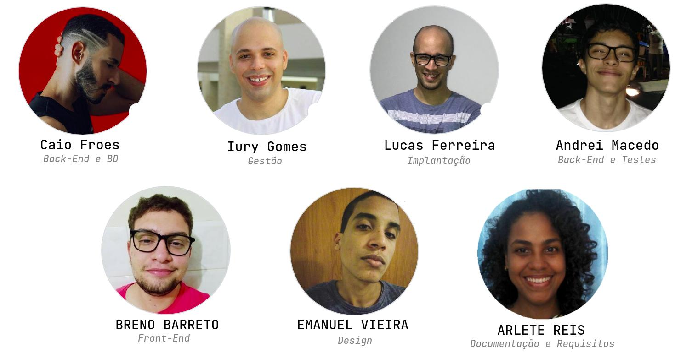

# Sistema de Progressões Acadêmicas da UFBA

Repositório contendo o projeto desenvolvido para a disciplina de TÓPICOS EM SISTEMAS DE INFORMAÇÃO E WEB I, do PGCOMP (Programa de Mestrado em Ciência da Computação da UFBA) sob orientação do Prof. Dr. Fred Durão, no ano de 2021

# Quem somos nós

  

- [Iury Gomes de Oliveira](https://github.com/iurygdeoliveira) (Gestão)
- [Lucas Ferreira](https://github.com/KasFerreira) (Implantação)
- [Andrei Macedo](https://github.com/asmcdo) (Back-End e Testes)
- [Breno Barreto de Souza Santos](https://github.com/brenobss) (Front-End)
- [Emanuel Vieira](https://github.com/emanuelvs) (Front-End e Design)
- [Cayo Froes](https://github.com/froescayo) (Back-End e BD)
- [Arlete Reis](https://github.com/arllette) (Requisitos e Documentação)

# Escopo

O projeto-piloto tem por objetivo desenvolver um sistema de cadastro da progressão e promoção do docente na carreira do Ensino Superior da Universidade Federal da Bahia.

# Demo

https://prog-acad.herokuapp.com/

# Arquitetura do Sistema

Link: https://whimsical.com/arquitetura-da-aplicacao-72ThrruL54ybvGVZX3mMfc

# [Diagramas UML](https://github.com/froescayo/prog-acad-web/tree/master/Diagramas%20UML)

### Caso de Uso

### Sequencia

# Regras de Negócio

[RN01] O requerente acessa o sistema através de convite para solicitar sua progressão ou promoção.
[RN02] O sistema deve calcular a pontuação do docente a partir de suas atividades realizadas em um interstício de 2 anos/4 semestres.
[RN03] O sistema deve “Incluir” comprovante das atividades que serão anexadas.
[RN04] O sistema deve informar o “Nome do Usuário” logado automaticamente.
[RN05] O sistema deve permitir que o perfil seja associado a um ou mais usuários. 
[RN06] O sistema não deve aceitar cadastrar mais de uma vez o mesmo usuário.

# Requisitos Funcionais

- RF01: O sistema deve permitir ao docente requerente solicitar progressão ou promoção 
- RF02: Cadastrar Docente
  - Nome Completo e  Siape
- RF03: O sistema deve permitir anexar as atividades do docente e documentos comprobatórios.
- RF04: O sistema deve permitir emitir comprovante das atividades anexadas.
- RF05: O sistema deve exportar o relatório final como uma planilha (.xls ou PDF), realizando o merge dos comprovantes.
- RF06: O sistema deve permitir ao avaliador, analisar as solicitações dos requerentes à progressão ou promoção, visualizando e atestando a veracidade dos documentos.

# Requisitos Não-Funcionais

- Confiabilidade
  - RNF01: O sistema deve garantir a atualização de dados feitos de forma atômica e imediata 
  - RNF02: O sistema deve fornecer disponibilidade 24/7 
- Desempenho
  - RNF03: O sistema deve permitir o acesso de diferentes usuários simultâneamente, mantento o tempo de resposta específico
- Usabilidade:
  -  RNF04: O sistema deve permitir facilidade de uso.
  -  RNF05: O sistema deve permitir navegabilidade fácil, contendo poucas páginas
- Segurança
  - RNF06: O sistema disponibiliza o acesso as ações das telas a partir da verificação do perfil do usuário 
  - RNF07: O sistema registra o log das operações, inclusão e edição realizadas pelos usuários. A tabela armazena a data/hora,usuário 
# Tecnologias Utilizadas
## [Front-End](https://github.com/froescayo/prog-acad-web)
- HTML5
- CSS3
- JS
- [FIGMA](https://www.figma.com/file/USqRlD1bGXuE3YP17iC3ea/PROCAD?node-id=0%3A1)
- ReactJS
## [Back-End](https://github.com/froescayo/prog-acad-api)

- NodeJs (Runtime Javascript em Back-End)
- Typescript (Linguagem de Programação )
- Postgres (Banco de Dados)
- Knex (Query Builder)
- Docker (Infraestrutura)
# Deploy
- ## Como Rodar o front-end

- Dependências
  - nodejs
  - npm
  - yarn

  1) Digite o comando no terminal > git clone https://github.com/froescayo/prog-acad-web.git

  2) Após isso entre na pasta do projeto ainda no terminal com > cd prog-acad-web

  3) Em seguida digite > npm install

  4) Por fim > npm start

- ## Como Rodar o back-end
  - Acessar [How To](https://github.com/froescayo/prog-acad-api)
# Documento de Implantação
- Sistema Operacional: 
  - O sistema é independente de SO, pois está sendo implatado sob a virtualização oferecida pelos containers do docker. Deste modo, no que se refere a sistema operacional, é exigido que host onde o sistema será instalado, possua ambiente docker instalado.
- Requisitos mínimos de memória e processamento:
  - Nosso sistema está rodando no ambiente grátis da heroku, de acordo com as especificações do site, o heroku usa uma unidade máquina virtual chamada Dyno, com  _1 VCPU de 4 cores_ e até  _512MB de RAM_ sem swap file e sem suporte a _persistência de arquivos_ 
- Softwares e versões das tecnologias macro
  - Front-End:
    - ReactJS (Versão 17.0.2)
    - HTMLS 5
    - CSS 3
    - Docker (Engine 20)
  - Back-End:
    - NodeJS (Versão 14.17.6)
    - Typescript (Versão 4.4)
    - Knex (0.95.11)
    - Docker (Engine 20)
- Versão do Banco de Dados
  - PostgreSQL (Versão estável 13.4)
  - Docker (Engine 20)
- Cloud a ser utilizado
  - Heroku (https://www.heroku.com/)
- Descrição de importação ou inicialização de dados, se aplicável
  - O processo de importação ou inicialização de dados será facilitado pela estratégia _Infrastructure as code_. Um arquivo docker-compose será criado, descrevendo toda infraesturura necessária para ser instalada e inicializada de forma automática pelo docker.
- Endereço de Acesso (URL e Porta)
  - url: https://prog-acad.herokuapp.com/
  - porta: 80 ou 443 
  - O sistema está hospedado no ambiente grátis da heroku, e segue as
  - configurações defaul deste ambiente para hospedagem grátis
- Políticas de permissões:
  - O sistema possuirá basicamente dois atores, o professor requerente, e professor avaliador. 
    - Professor requerente, será permitido:
      - Adicionar, editar, visualizar e excluir itens do seu processo de progressão
    - Professor avaliador, será permitido:
      - Visualizar e avaliar o processo de progressão
# Proposta de Testes

- Como testar o seu portal web ?
  - No próprio portal
- Utilização alguma ferramenta ?
  - No proprio portal
  - Requisições por meio do Insominia
- Serão realizados testes unitários ?
  - Não
- Quem irá testar o sistema ? 
  - Será a equipe
[Documento de Caso de Teste](https://docs.google.com/document/d/18urdVJDw2veKayaqE6ScBmAvY70f-yxZVegUkVgeGYw/edit)

  
